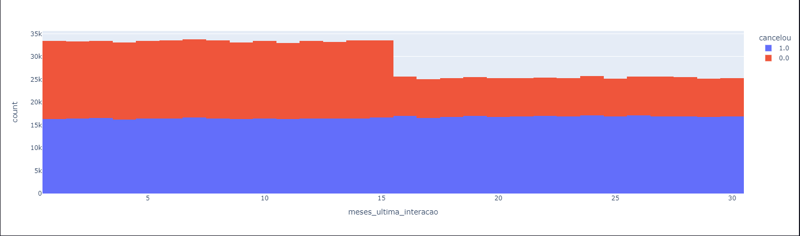

# data_analysis
program to analyze data from csv format tables, with the aim of verifying the main factors in the cancellation of plans

[pandas](https://pandas.pydata.org/)
[numpy](https://numpy.org/)
[openyxl](https://openpyxl.readthedocs.io/en/stable/)
[ipykernel](https://ipython.readthedocs.io/en/stable/install/kernel_install.html)
[plotly](https://plotly.com/)

# Table

## Pre first filter

## Pos first-filter

## Initial analysis

## Graphics

# Final analysis

After analyzing the database, the three main cancellation points were identified, after filtering these columns the cancellation rate dropped from 56% to 18%.